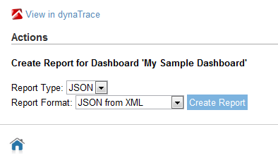

# JSON Reporting Plugin

## Overview

This plugin enables dynaTrace Dashboard Reports to produce JSON Output. Use this Plugin to integrate dynaTrace Dashboard data with e.g: your existing Web 2.0 Portals by requesting dynaTrace Report
Data in JSON Data Format

| Name | JSON Reporting Plugin
| :--- | :---
| Author |Dominik Stadler (dominik.stadler@compuware.com)
| Supported dynaTrace Versions | >= 5.5
| Support | [Not Supported](https://community.compuwareapm.com/community/display/DL/Support+Levels)
| Download | [com.dynatrace.diagnostics.report.json.plugin.dtp](com.dynatrace.diagnostics.report.json.plugin.dtp)
| Release history | Version 1.0

## Description

This Plugin provides a new reporting type for both Client and Server-Side Reporting.

**In the Client you have a new JSON Format Option**  

Through the Server-Side Reporting Interfaces it provides different JSON Formatting options with _JSON from XML_ providing a pretty printed version of the data that you would normally get using the XML
Format Type.

**Format Option through the Server-Side Reporting Interface**  

**Following shows the JSON from XML Output**  

## Installation

1\. [Download the plugin](dynatrace.diagnostics.report.json.plugin.dtp)  
2\. Either double click the .dtp file or Import the Plugin through [Manage Plugins](https://community.compuwareapm.com/community/display/DOCDT35/Plugins)  
3\. After installing the Plugin you have to restart both dynaTrace Server and Client

