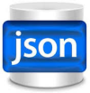

## JSON Reporting Plugin

This plugin enables dynaTrace Dashboard Reports to produce JSON Output. Use this Plugin to integrate dynaTrace Dashboard data with e.g: your existing Web 2.0 Portals by requesting dynaTrace Report
Data in JSON Data Format

Find further information in the [dynaTrace community](https://community.dynatrace.com/community/display/DL/JSON+Reporting+Plugin)

## Enhancing/Building/Development

#### Change it

Create matching Eclipse project files

	./gradlew eclipse

Run unit tests

	./gradlew check jacocoTestReport

#### Build it

	./gradlew -PdynaTraceVersion=5.5.0.<x> plugin

Note: Set the version higher every time you deploy to ensure the new version is loaded in the Dynatrace Server.

#### Deploy it

* The resulting .dtp file can be found in the directory `plugin/dist`
* Use the plugin-dialog in the Dynatrace Client to upload the plugin to the server.
* Note that a restart of the Server which is running the plugin might be required
  in some cases (e.g. when upgrading from a previous version of the plugin).
